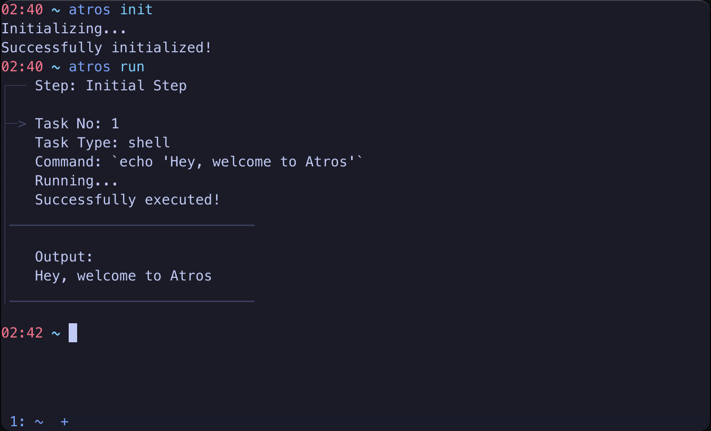

# 🔧 Atros - Automation for The Rest Of uS

Automate your tasks with Atros, simply and ergonomically.



## Features

- 🚀 **Blazingly Fast:** I'm not sure how fast it is, but it's written in 100% Rust btw 😉
- ✅ **Easy to Write Tasks:** Write your tasks in Typescript easily with in-editor documentation and conditional types
- 💻 **Define Cross-platform Tasks:** Specify the platform your task will work
- 📥 **Cross-platform Install Tasks:** Don't worry about installing packages for every system. Just define install tasks, and give a package list to install them
- 💾 **Caching:** Atros caches your execution results. So you don't have to worry about running a succeeded task twice. This is useful when you have succeeded and failed tasks in a step at the same time
- 🤝 **Works With All Javascript Runtimes:** Node, Bun, Deno. Doesn't matter, all you guys are welcome. Just have at least one of them installed in your system

## Upcoming Features

- 🔑 **Store Sensitive Keys Easily:** Encrypt, decrypt, and use your keys easily in your tasks
- 🧪 **Test Your Tasks:** Write tests for your tasks. Tests for install tasks are defined by default, and cross-platform. Run tests to see if your system has everything up and going, or tasks with only failed tests
- </> **Run and Test Via Git, Without an Installation:** Because sometimes you just wonder if you have a system that's capable of doing things that some guy on the internet's is.
- 🪟 **Windows Support:** Not promised for a long period of time. But seems like it's the point that the project is headed to

## Getting Started

To get started, you need to build Atros from source using Cargo. Binary sources will be provided in the upcoming releases.

```sh
git clone https://github.com/Atros-Automation-Tools/atros
cd atros
cargo build --release
```

Now the binary is created. To run it from anywhere, you can move the binary to a bin folder, like /usr/local/bin:

```sh
sudo mv ./target/release/atros /usr/local/bin
```

You may need to run source command or open up a new terminal to run atros command.
After the installation is complete, run `atros init`, and it'll create the initial configurations on ~/.config/atros/

To edit your tasks, go to ~/.config/atros/steps/ Here, you can create and edit your tasks easily. Step structure is easy to understand, you can take a look at the initial step.

> Note: It's recommended to create your steps file as `number`.ts, to easily run them in order.

## Status

Atros is still in its early days, so issues are to be expected. Also, v1.0 has not been released yet, therefore incompatibilities with the new versions should be expected for some functionalities. But Atros is available for use in task automation today, and no big breaking changes are expected for the main functionalities like task definitions. Still, compatibility is not promised ☠️

## Contributing

Please refer to the [contribution guide](/CONTRIBUTING.md).
